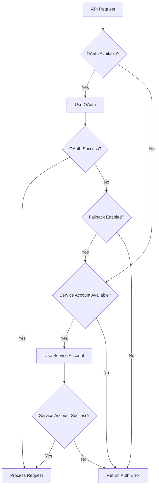

# Alternative Authentication System

## Overview

The Calendar Assistant now supports an alternative authentication system that provides **service account authentication** as a fallback to the existing OAuth user authentication. This system maintains **full backward compatibility** while adding new capabilities for server-to-server operations.

## Key Features

### 🔐 Dual Authentication Support
- **Primary**: User OAuth (existing functionality preserved)
- **Alternative**: Google Service Account authentication
- **Automatic Fallback**: Seamlessly switch between authentication methods

### 🔄 Backward Compatibility
- All existing OAuth functionality remains unchanged
- Existing API endpoints work exactly as before
- No breaking changes to the current implementation

### 🛡️ Enhanced Reliability
- Service account fallback when OAuth tokens expire
- Server-to-server authentication for background operations
- Reduced dependency on user session state

## Architecture

### Core Components

1. **ServiceAccountAuth** (`src/lib/service-account-auth.ts`)
   - Manages Google Service Account credentials
   - Handles authentication with Google APIs
   - Supports domain-wide delegation

2. **Enhanced Auth Functions** (`src/lib/auth.ts`)
   - Extended authentication helpers
   - Fallback mechanisms
   - Compatibility functions

3. **EnhancedCalendarService** (`src/services/enhanced-calendar-service.ts`)
   - Drop-in replacement for CalendarService
   - Automatic authentication fallback
   - Mixed authentication support

4. **Configuration** (`settings/alternative-auth.json`)
   - Enable/disable alternative authentication
   - Configure service account options
   - Control fallback behavior

## Setup Instructions

### 1. Service Account Credentials

The system uses the existing service account file:
```
settings/gptcalendarintegration-59a55f630b26.json
```

Ensure this file contains valid Google Service Account credentials with calendar access.

### 2. Configuration

The alternative authentication system is configured via `settings/alternative-auth.json`:

```json
{
  "alternativeAuth": {
    "enabled": true,
    "serviceAccount": {
      "enabled": true,
      "credentialsFile": "gptcalendarintegration-59a55f630b26.json",
      "fallbackOnOAuthFailure": true,
      "domainWideDelegate": false,
      "subject": null
    }
  },
  "compatibility": {
    "preserveOAuthAsDefault": true,
    "allowMixedAuth": true,
    "logAuthType": true
  }
}
```

### 3. Calendar Sharing (Important!)

For service account authentication to work, calendars must be shared with the service account:

1. Open Google Calendar
2. Go to calendar settings
3. Share the calendar with: `ai-assistant@gptcalendarintegration.iam.gserviceaccount.com`
4. Grant "Make changes to events" permission

## Usage Examples

### Basic Usage (Automatic Fallback)

```typescript
import { EnhancedCalendarService } from '@/services/enhanced-calendar-service';

// Create service with automatic authentication
const calendarService = await EnhancedCalendarService.createWithFallback(
  userOAuthClient, // Can be undefined
  false // preferServiceAccount
);

// Use exactly like the original CalendarService
const events = await calendarService.getEvents();
```

### Service Account Only

```typescript
// Force service account authentication
const serviceCalendarService = await EnhancedCalendarService.createWithFallback(
  undefined,
  true // prefer service account
);

console.log(serviceCalendarService.getAuthType()); // 'service-account'
```

### Check Authentication Capabilities

```typescript
import { isServiceAccountAvailable } from '@/lib/auth';

if (isServiceAccountAvailable()) {
  console.log('Service account authentication available');
}

const service = await EnhancedCalendarService.createWithFallback(userAuth);
if (service.canFallbackToServiceAccount()) {
  console.log('Can fallback to service account if needed');
}
```

## API Integration

### Chat API Enhancement

The chat API (`/api/chat`) now supports alternative authentication:

```javascript
// The system automatically detects configuration and uses fallback
// when OAuth tokens are unavailable or expired

POST /api/chat
{
  "message": "show my calendar events",
  "useTools": true,
  "developmentMode": true
}
```

### Test Endpoint

Test the alternative authentication system:

```bash
# Test with user authentication
GET /api/test/alternative-auth

# Force service account testing
GET /api/test/alternative-auth?serviceAccount=true
```

## Configuration Options

### Service Account Settings

| Option | Description | Default |
|--------|-------------|---------|
| `enabled` | Enable service account auth | `true` |
| `credentialsFile` | Service account JSON file | `gptcalendarintegration-59a55f630b26.json` |
| `fallbackOnOAuthFailure` | Auto-fallback when OAuth fails | `true` |
| `domainWideDelegate` | Enable domain-wide delegation | `false` |
| `subject` | User to impersonate (delegation) | `null` |

### Compatibility Settings

| Option | Description | Default |
|--------|-------------|---------|
| `preserveOAuthAsDefault` | Keep OAuth as primary method | `true` |
| `allowMixedAuth` | Allow both auth types in same session | `true` |
| `logAuthType` | Log which auth method is used | `true` |

## Authentication Flow



## Logging and Monitoring

The system provides detailed logging for authentication events:

```
🔐 Using user OAuth authentication
🔧 Using service account authentication
🔄 User OAuth failed, attempting service account fallback...
✅ Service account fallback successful
```

## Security Considerations

### Service Account Security
- Service account credentials are stored securely in `settings/`
- Credentials file is gitignored to prevent accidental commits
- Limited scopes (calendar access only)

### Access Control
- Service account requires explicit calendar sharing
- No automatic access to all user calendars
- Respects existing email filtering for UI access

### Best Practices
1. Regularly rotate service account keys
2. Monitor service account usage logs
3. Grant minimal required permissions
4. Use domain-wide delegation only when necessary

## Testing

### Unit Tests
```bash
npm test -- alternative-authentication.test.ts
```

### Integration Tests
```bash
# Test authentication system
curl http://localhost:3000/api/test/alternative-auth

# Test chat with fallback
curl -X POST http://localhost:3000/api/chat \
  -H "Content-Type: application/json" \
  -d '{"message": "show events", "useTools": true}'
```

## Troubleshooting

### Common Issues

1. **Service account credentials not found**
   ```
   Solution: Ensure gptcalendarintegration-59a55f630b26.json exists in settings/
   ```

2. **Permission denied errors**
   ```
   Solution: Share calendars with ai-assistant@gptcalendarintegration.iam.gserviceaccount.com
   ```

3. **Fallback not working**
   ```
   Solution: Check alternative-auth.json configuration
   ```

### Debug Information

Enable debug logging by setting `logAuthType: true` in configuration:

```json
{
  "compatibility": {
    "logAuthType": true
  }
}
```

## Migration Guide

### For Existing Users
No changes required! The system maintains full backward compatibility.

### For New Features
Use `EnhancedCalendarService` instead of `CalendarService` for new implementations:

```typescript
// Old way (still works)
const service = new CalendarService(oauthClient);

// New way (with fallback support)
const service = await EnhancedCalendarService.createWithFallback(oauthClient);
```

## Future Enhancements

- **API Key Authentication**: Additional auth method for simple operations
- **Multi-tenant Support**: Different service accounts per user/organization
- **Token Caching**: Improved performance for service account operations
- **Health Monitoring**: Real-time authentication status dashboard

## Support

For issues or questions about the alternative authentication system:

1. Check the troubleshooting section above
2. Review the test endpoint output: `/api/test/alternative-auth`
3. Examine server logs for authentication events
4. Verify service account calendar sharing permissions

The alternative authentication system is designed to be robust, secure, and fully backward compatible with existing OAuth implementations.
